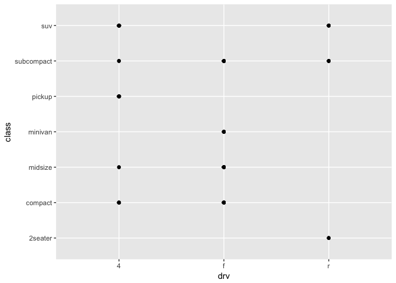

# mpg.practice
Veronica  
4/24/2017  


## MPG dataset practice
### 3.2 First Steps


```r
mpg
```

```
## # A tibble: 234 × 11
##    manufacturer      model displ  year   cyl      trans   drv   cty   hwy
##           <chr>      <chr> <dbl> <int> <int>      <chr> <chr> <int> <int>
## 1          audi         a4   1.8  1999     4   auto(l5)     f    18    29
## 2          audi         a4   1.8  1999     4 manual(m5)     f    21    29
## 3          audi         a4   2.0  2008     4 manual(m6)     f    20    31
## 4          audi         a4   2.0  2008     4   auto(av)     f    21    30
## 5          audi         a4   2.8  1999     6   auto(l5)     f    16    26
## 6          audi         a4   2.8  1999     6 manual(m5)     f    18    26
## 7          audi         a4   3.1  2008     6   auto(av)     f    18    27
## 8          audi a4 quattro   1.8  1999     4 manual(m5)     4    18    26
## 9          audi a4 quattro   1.8  1999     4   auto(l5)     4    16    25
## 10         audi a4 quattro   2.0  2008     4 manual(m6)     4    20    28
## # ... with 224 more rows, and 2 more variables: fl <chr>, class <chr>
```


```r
ggplot(data = mpg) +
  geom_point(mapping =aes(x = displ, y = hwy))
```

<!-- -->

#### 3.2 Exercises  
**1. Run "ggplot(data = mpg)" what do you see?**

```r
ggplot(data = mpg)
```

<!-- -->

This renders a blank coordinate plane. The graphing layer and mapping were not defined.  

**2. How many rows are in mtcars? How many columns?**

There are 32 rows and 11 columns in mtcars. (inline coding used)  

**3. What does the drv variable describe? Read the help for ?mpg to find out.**

```r
?mpg
```

According to the mpg help file drv describes the drive of the car such that "f = front-wheel drive, r = rear wheel drive, 4 = 4wd".  

**4. Make a scatterplot of hwy vs cyl.**

```r
ggplot (data = mpg) +
  geom_point(mapping = aes(x = cyl, y = hwy))
```

<!-- -->

**5. What happens if you make a scatterplot of class vs drv. Why is the plot not useful?**

```r
ggplot(data = mpg) +
  geom_point(mapping = aes(x = drv, y = class))
```

<!-- -->
Drive and class are two fields that are used to describe the data, therefore they do not influence one another and will not yield useful insight when compared. 


### 3.3 Aesthetic mappings

#### 3.3 Exercises
**1. What’s gone wrong with this code? Why are the points not blue?**

```r
ggplot(data = mpg) + 
  geom_point(mapping = aes(x = displ, y = hwy, color = "blue"))
```

<!-- -->

In order to make change the color of the points to blue, the aesthetic value color must appear _outside_ of the aesthetic parens, as show below.


```r
ggplot(data = mpg) + 
  geom_point(mapping = aes(x = displ, y = hwy), color = "blue")
```

<!-- -->

**2. Which variables in mpg are categorical? Which variables are continuous? (Hint: type ?mpg to read the documentation for the dataset). How can you see this information when you run mpg?**  
To determine which variables in mpg are continuous and which are categorical we can examine the summary of mpg

```r
summary(mpg)
```

```
##  manufacturer          model               displ            year     
##  Length:234         Length:234         Min.   :1.600   Min.   :1999  
##  Class :character   Class :character   1st Qu.:2.400   1st Qu.:1999  
##  Mode  :character   Mode  :character   Median :3.300   Median :2004  
##                                        Mean   :3.472   Mean   :2004  
##                                        3rd Qu.:4.600   3rd Qu.:2008  
##                                        Max.   :7.000   Max.   :2008  
##       cyl           trans               drv                 cty       
##  Min.   :4.000   Length:234         Length:234         Min.   : 9.00  
##  1st Qu.:4.000   Class :character   Class :character   1st Qu.:14.00  
##  Median :6.000   Mode  :character   Mode  :character   Median :17.00  
##  Mean   :5.889                                         Mean   :16.86  
##  3rd Qu.:8.000                                         3rd Qu.:19.00  
##  Max.   :8.000                                         Max.   :35.00  
##       hwy             fl               class          
##  Min.   :12.00   Length:234         Length:234        
##  1st Qu.:18.00   Class :character   Class :character  
##  Median :24.00   Mode  :character   Mode  :character  
##  Mean   :23.44                                        
##  3rd Qu.:27.00                                        
##  Max.   :44.00
```
The variables manufacturer, model, trans, drv, fl, and class are categorical.
The variables displ, year, cly, cty, and hwy are continuous. 

**3. Map a continuous variable to color, size, and shape. How do these aesthetics behave differently for categorical vs. continuous variables?**

```r
ggplot(data = mpg) + 
  geom_point(mapping = aes(x = displ, y = hwy, color = cty))
```

<!-- -->

```r
ggplot(data = mpg) + 
  geom_point(mapping = aes(x = displ, y = hwy, size = cty))
```

<!-- -->

```r
#ggplot(data = mpg) + 
  #geom_point(mapping = aes(x = displ, y = hwy, shape = cty))
# will not plot
```
Continuous data will be scaled on a gradient for color and size but not plot if assigned to shape. 

**4. What happens if you map the same variable to multiple aesthetics?**

```r
ggplot(data = mpg) + 
  geom_point(mapping = aes(x = displ, y = hwy, color = cyl, size = cyl))
```

<!-- -->
The variable will be plotted using both aesthetics.

**5. What does the stroke aesthetic do? What shapes does it work with?**

```r
ggplot(data = mpg) + 
  geom_point(mapping = aes(x = displ, y = hwy, stroke = 1))
```

<!-- -->

```r
ggplot(data = mpg) + 
  geom_point(mapping = aes(x = displ, y = hwy, stroke = 5))
```

<!-- -->
The stroke aesthetic changes the size of the shapes in geom_point. It seems that stroke will apply to all values for shape between 1-25. 

**6. What happens if you map an aesthetic to something other than a variable name, like aes(colour = displ < 5)?**

```r
ggplot(data = mpg) + 
  geom_point(mapping = aes(x = displ, y = hwy, color = displ < 5))
```

<!-- -->
Setting an aesthetic to a value besides a variable name will plot the aesthetic accoridng to that qualifier. In the example above color is plotted between two classes, data where displ >5 and < 5. 


### 3.5 Facets
#### 3.5 Exercises

**1. What happens if you facet on a continuous variable?**

```r
ggplot(data = mpg) + 
  geom_point(mapping = aes(x = displ, y = hwy)) + 
  facet_wrap( ~ cty, nrow = 2)
```

<!-- -->
If a continuous variable is used to facet the data will be faceted according to the individual values in that variable. 

**2. What do the empty cells in plot with facet_grid(drv ~ cyl) mean? How do they relate to this plot?**

```r
ggplot(data = mpg) + 
  geom_point(mapping = aes(x = drv, y = cyl)) + 
  facet_grid(drv ~ cyl)
```

<!-- -->
The empty grids in this plot indicate that there is no data that falls into both variables that are defined as facets. For example, there are no observations for which drv = 4 and cyl = 5. For this data set it is useful to see which combinations are not represented in the observations. 

**3. What plots does the following code make? What does . do?**

```r
ggplot(data = mpg) + 
  geom_point(mapping = aes(x = displ, y = hwy)) +
  facet_grid(drv ~ .)
```

<!-- -->

```r
ggplot(data = mpg) + 
  geom_point(mapping = aes(x = displ, y = hwy)) +
  facet_grid(. ~ cyl)
```

<!-- -->
Both graphs complare engine displacement and highway gas mileage but facet that data different. The first facets data by drive vertically while the second facets by numebr of cylinders horizontally. The "." acts as a placeholder in the function facet_grid() so that it may be used like facet_wrap() to facet data using one variable.   

**4. Take the first faceted plot in this section (included below). What are the advantages to using faceting instead of the colour aesthetic? What are the disadvantages? How might the balance change if you had a larger dataset?**

```r
ggplot(data = mpg) + 
  geom_point(mapping = aes(x = displ, y = hwy)) + 
  facet_wrap(~ class, nrow = 2)
```

<!-- -->
Using facet instead of color aesthetic to visualize the data can make trends within a variable more clear, but hide overarching trends in the entire data set. In a loarger data set it might be more benficial to facet the data to analyze trends in individual variables, and less important to use the color aesthetic to see overarching trends.  

**5. Read ?facet_wrap. What does nrow do? What does ncol do? What other options control the layout of the individual panels? Why doesn’t facet_grid() have nrow and ncol variables?**

nrow and ncol define the number of rows or colums, and the direction, by hwich the data is faceted. as.table can also be used to change the layout of panels. In facet_grid(), nrow and ncol are defined by the variables used to define facets, with "." indicating one row or column. 

**6. When using facet_grid() you should usually put the variable with more unique levels in the columns. Why?**

Puting the variable with the most unique number of levels in the rows can result in an oddly shaped figured. 


