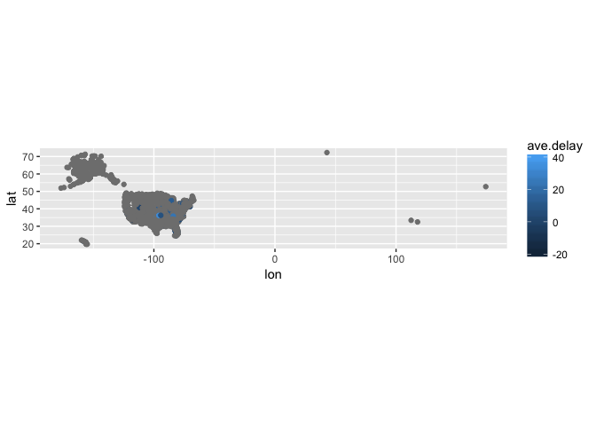
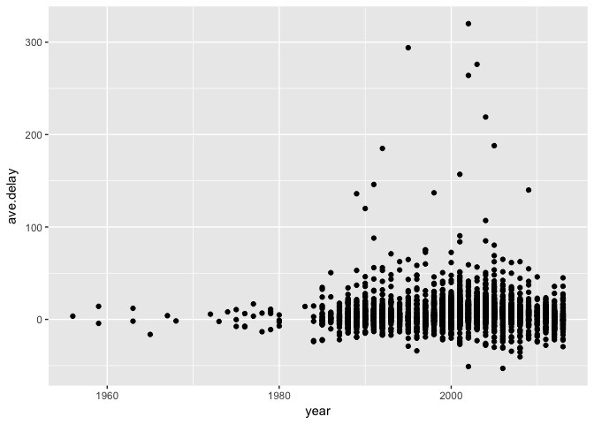
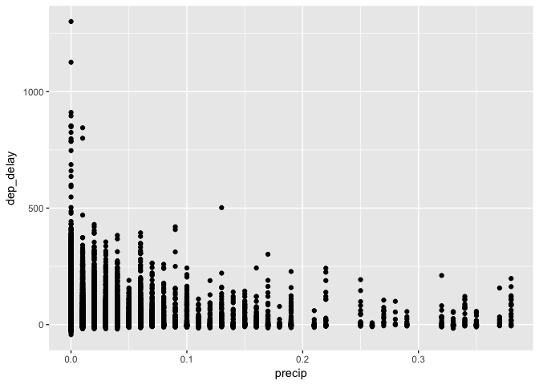
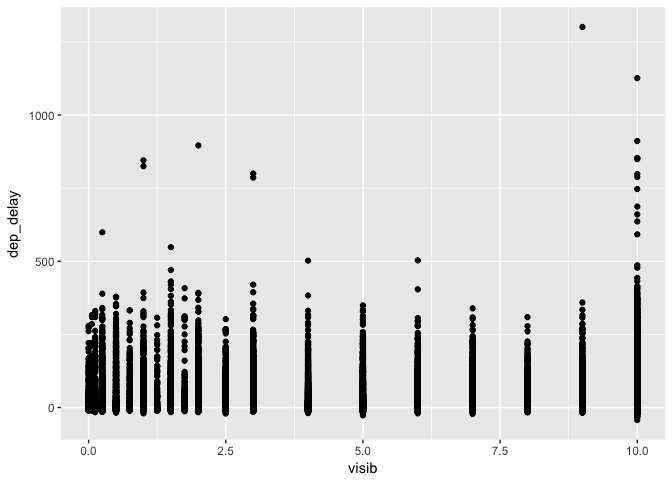
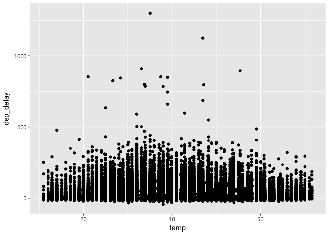
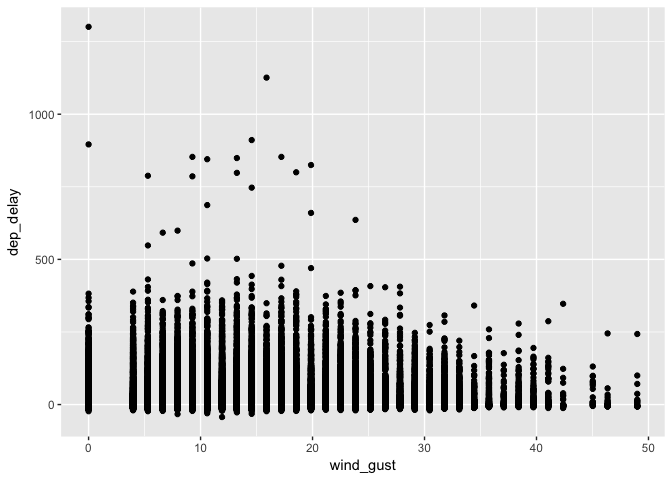
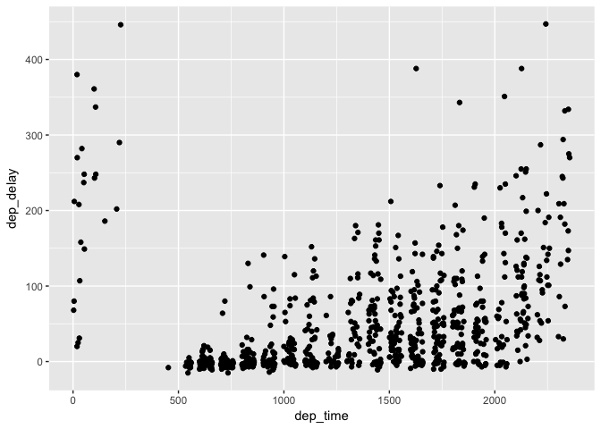

# Relational_data
Veronica  
6/23/2017  


### 13.3 Keys

**1. Add a surrogate key to flights.**  

```r
flights %>% 
  mutate(ID = row_number()) %>% 
  summary()
```

```
##       year          month             day           dep_time   
##  Min.   :2013   Min.   : 1.000   Min.   : 1.00   Min.   :   1  
##  1st Qu.:2013   1st Qu.: 4.000   1st Qu.: 8.00   1st Qu.: 907  
##  Median :2013   Median : 7.000   Median :16.00   Median :1401  
##  Mean   :2013   Mean   : 6.549   Mean   :15.71   Mean   :1349  
##  3rd Qu.:2013   3rd Qu.:10.000   3rd Qu.:23.00   3rd Qu.:1744  
##  Max.   :2013   Max.   :12.000   Max.   :31.00   Max.   :2400  
##                                                  NA's   :8255  
##  sched_dep_time   dep_delay          arr_time    sched_arr_time
##  Min.   : 106   Min.   : -43.00   Min.   :   1   Min.   :   1  
##  1st Qu.: 906   1st Qu.:  -5.00   1st Qu.:1104   1st Qu.:1124  
##  Median :1359   Median :  -2.00   Median :1535   Median :1556  
##  Mean   :1344   Mean   :  12.64   Mean   :1502   Mean   :1536  
##  3rd Qu.:1729   3rd Qu.:  11.00   3rd Qu.:1940   3rd Qu.:1945  
##  Max.   :2359   Max.   :1301.00   Max.   :2400   Max.   :2359  
##                 NA's   :8255      NA's   :8713                 
##    arr_delay          carrier              flight       tailnum         
##  Min.   : -86.000   Length:336776      Min.   :   1   Length:336776     
##  1st Qu.: -17.000   Class :character   1st Qu.: 553   Class :character  
##  Median :  -5.000   Mode  :character   Median :1496   Mode  :character  
##  Mean   :   6.895                      Mean   :1972                     
##  3rd Qu.:  14.000                      3rd Qu.:3465                     
##  Max.   :1272.000                      Max.   :8500                     
##  NA's   :9430                                                           
##     origin              dest              air_time        distance   
##  Length:336776      Length:336776      Min.   : 20.0   Min.   :  17  
##  Class :character   Class :character   1st Qu.: 82.0   1st Qu.: 502  
##  Mode  :character   Mode  :character   Median :129.0   Median : 872  
##                                        Mean   :150.7   Mean   :1040  
##                                        3rd Qu.:192.0   3rd Qu.:1389  
##                                        Max.   :695.0   Max.   :4983  
##                                        NA's   :9430                  
##       hour           minute        time_hour                  
##  Min.   : 1.00   Min.   : 0.00   Min.   :2013-01-01 05:00:00  
##  1st Qu.: 9.00   1st Qu.: 8.00   1st Qu.:2013-04-04 13:00:00  
##  Median :13.00   Median :29.00   Median :2013-07-03 10:00:00  
##  Mean   :13.18   Mean   :26.23   Mean   :2013-07-03 05:02:36  
##  3rd Qu.:17.00   3rd Qu.:44.00   3rd Qu.:2013-10-01 07:00:00  
##  Max.   :23.00   Max.   :59.00   Max.   :2013-12-31 23:00:00  
##                                                               
##        ID        
##  Min.   :     1  
##  1st Qu.: 84195  
##  Median :168388  
##  Mean   :168388  
##  3rd Qu.:252582  
##  Max.   :336776  
## 
```

**2. Identify the keys in the following datasets:**  

```r
Lahman::Batting %>% 
  count(playerID, yearID, stint) %>% 
  filter(n>1)
```

```
## Source: local data frame [0 x 4]
## Groups: playerID, yearID [0]
## 
## # ... with 4 variables: playerID <chr>, yearID <int>, stint <int>, n <int>
```

```r
babynames2 <- as.data.frame(babynames)

babynames2 %>% 
  count(year, sex, name)  %>% 
  summary()
```

```
##       year          sex                name                 nn   
##  Min.   :1880   Length:1858689     Length:1858689     Min.   :1  
##  1st Qu.:1950   Class :character   Class :character   1st Qu.:1  
##  Median :1983   Mode  :character   Mode  :character   Median :1  
##  Mean   :1973                                         Mean   :1  
##  3rd Qu.:2002                                         3rd Qu.:1  
##  Max.   :2015                                         Max.   :1
```

```r
#this data set will not filter

nasaweather::atmos %>% 
  count(lat, long, year, month) %>% 
  filter(n>1)
```

```
## Source: local data frame [0 x 5]
## Groups: lat, long, year [0]
## 
## # ... with 5 variables: lat <dbl>, long <dbl>, year <int>, month <int>,
## #   n <int>
```

```r
fueleconomy::vehicles %>% 
  count(id) %>% 
  filter(n>1)
```

```
## # A tibble: 0 × 2
## # ... with 2 variables: id <int>, n <int>
```

```r
#ggplot2::diamonds 
#There is no key
```

**3. Draw a diagram illustrating the connections between the Batting, Master, and Salaries tables in the Lahman package. Draw another diagram that shows the relationship between Master, Managers, AwardsManagers.**

**How would you characterise the relationship between the Batting, Pitching, and Fielding tables?**

Batting decribed offensive performance of a player while Pitching and Fielding describe the defensive performance.

### 13.4 Mutating Joins  


```r
flights2 <- flights %>% 
  select(year:day, hour, origin, dest, tailnum, carrier)
```

**1. Compute the average delay by destination, then join on the airports data frame so you can show the spatial distribution of delays. Here’s an easy way to draw a map of the United States:**


```r
flights %>% 
  select(dest, arr_delay) %>% 
  group_by(dest) %>% 
  summarize(ave.delay = mean(arr_delay, na.rm =T)) %>%
  right_join(airports, c("dest" = "faa")) %>%
  ggplot(aes(lon, lat, color = ave.delay)) +
    borders("state") +
    geom_point() +
    coord_quickmap()
```

<!-- -->

not sure what my outliers here are

**2. Add the location of the origin and destination (i.e. the lat and lon) to flights.**

```r
airports2 <- airports %>% 
  select(faa, lat, lon)

flights2 %>% 
  left_join(airports2, c("origin" = "faa")) %>% 
  rename("origin_lat" = lat, "origin_lon" = lon) %>% 
  left_join(airports2, c("dest" = "faa")) %>% 
  rename("dest_lat" = lat, "dest_lon" = lon)
```

```
## # A tibble: 336,776 × 12
##     year month   day  hour origin  dest tailnum carrier origin_lat
##    <int> <int> <int> <dbl>  <chr> <chr>   <chr>   <chr>      <dbl>
## 1   2013     1     1     5    EWR   IAH  N14228      UA   40.69250
## 2   2013     1     1     5    LGA   IAH  N24211      UA   40.77725
## 3   2013     1     1     5    JFK   MIA  N619AA      AA   40.63975
## 4   2013     1     1     5    JFK   BQN  N804JB      B6   40.63975
## 5   2013     1     1     6    LGA   ATL  N668DN      DL   40.77725
## 6   2013     1     1     5    EWR   ORD  N39463      UA   40.69250
## 7   2013     1     1     6    EWR   FLL  N516JB      B6   40.69250
## 8   2013     1     1     6    LGA   IAD  N829AS      EV   40.77725
## 9   2013     1     1     6    JFK   MCO  N593JB      B6   40.63975
## 10  2013     1     1     6    LGA   ORD  N3ALAA      AA   40.77725
## # ... with 336,766 more rows, and 3 more variables: origin_lon <dbl>,
## #   dest_lat <dbl>, dest_lon <dbl>
```

**3. Is there a relationship between the age of a plane and its delays?**

```r
planes2 <- planes %>% 
  select(tailnum, year)

flights %>% 
  group_by(tailnum) %>% 
  summarize(ave.delay = mean(arr_delay, na.rm =T)) %>% 
  left_join(planes) %>% 
  ggplot(aes(year, ave.delay)) +
  geom_point()
```

```
## Joining, by = "tailnum"
```

```
## Warning: Removed 798 rows containing missing values (geom_point).
```

<!-- -->

There does not appear to be a coorelation between the year the plane was made and ave.delay for that tail number.

**4. What weather conditions make it more likely to see a delay?**

```r
flights %>% 
  left_join(weather) %>% 
  filter(wind_speed <= 100) %>% 
  ggplot(aes(wind_speed, dep_delay)) +
  geom_point()
```

```
## Joining, by = c("year", "month", "day", "origin", "hour", "time_hour")
```

```
## Warning: Removed 3902 rows containing missing values (geom_point).
```

<!-- -->

```r
flights %>% 
  left_join(weather) %>% 
  ggplot(aes(precip, dep_delay)) +
  geom_point()
```

```
## Joining, by = c("year", "month", "day", "origin", "hour", "time_hour")
```

```
## Warning: Removed 201649 rows containing missing values (geom_point).
```

<!-- -->

```r
flights %>% 
  left_join(weather) %>% 
  ggplot(aes(visib, dep_delay)) +
  geom_point()
```

```
## Joining, by = c("year", "month", "day", "origin", "hour", "time_hour")
```

```
## Warning: Removed 201649 rows containing missing values (geom_point).
```

<!-- -->

```r
flights %>% 
  left_join(weather) %>% 
  ggplot(aes(temp, dep_delay)) +
  geom_point()
```

```
## Joining, by = c("year", "month", "day", "origin", "hour", "time_hour")
```

```
## Warning: Removed 201649 rows containing missing values (geom_point).
```

<!-- -->

```r
flights %>% 
  left_join(weather) %>% 
  filter(wind_gust <= 100) %>% 
  ggplot(aes(wind_gust, dep_delay)) +
  geom_point()
```

```
## Joining, by = c("year", "month", "day", "origin", "hour", "time_hour")
```

```
## Warning: Removed 3902 rows containing missing values (geom_point).
```

<!-- -->

**5. What happened on June 13 2013? Display the spatial pattern of delays, and then use Google to cross-reference with the weather.**


```r
flights %>%
  filter(month == 6, day == 13, year == 2013) %>%
  ggplot(aes(dep_time, dep_delay)) +
  geom_point()
```

```
## Warning: Removed 95 rows containing missing values (geom_point).
```

<!-- -->

There was an unusually strong summer storm that passed through New York in the afternoon.

### Filtering Joins

**1. What does it mean for a flight to have a missing tailnum? What do the tail numbers that don’t have a matching record in planes have in common? (Hint: one variable explains ~90% of the problems.)**


```r
flights %>% 
  filter(tailnum == NA)
```

```
## # A tibble: 0 × 19
## # ... with 19 variables: year <int>, month <int>, day <int>,
## #   dep_time <int>, sched_dep_time <int>, dep_delay <dbl>, arr_time <int>,
## #   sched_arr_time <int>, arr_delay <dbl>, carrier <chr>, flight <int>,
## #   tailnum <chr>, origin <chr>, dest <chr>, air_time <dbl>,
## #   distance <dbl>, hour <dbl>, minute <dbl>, time_hour <dttm>
```


