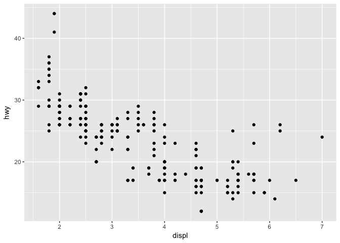

# ggplot.2
Veronica  
5/2/2017  


### Data Visualization

#### 3.6 Geometric Objects

**1. What geom would you use to draw a line chart? A boxplot? A histogram? An area chart?**  
geom_line(), geom_boxplot(), geom_histogram(), geom_area()

**2. Run this code in your head and predict what the output will look like. Then, run the code in R and check your predictions.**  
A plot comparing displ and hwy, with all data points color coded by drv. line graphs will be also be divided by and color coded by drv.


```r
ggplot(data = mpg, mapping = aes(x = displ, y = hwy, color = drv)) + 
  geom_point() + 
  geom_smooth(se = FALSE)
```

```
## `geom_smooth()` using method = 'loess'
```

<!-- -->

**3. What does show.legend = FALSE do? What happens if you remove it?
Why do you think I used it earlier in the chapter?**  
show.legend = FALSE will hide the legend. if removed from a line of code the legend will be displayed in the plot. Sometimes the legend is described somewhere else or not aestheitically pleasing and can be removed. 

**4. What does the se argument to geom_smooth() do?**  
The se argument determines whether or not the standard error lines will be included in the graph. when se = FALSE they will not be included. The default is se = TRUE

**5. Will these two graphs look different? Why/why not?**  

**ggplot(data = mpg, mapping = aes(x = displ, y = hwy)) +** 
  **geom_point() + **
  **geom_smooth()**

**ggplot() + **
  **geom_point(data = mpg, mapping = aes(x = displ, y = hwy)) + **
  **geom_smooth(data = mpg, mapping = aes(x = displ, y = hwy))**
  
These graphs will not look different. Here, two types of plots are used in the same plot area. In order to make the code easier to manipulate, the mapping aesthetics are located in the initial ggplot() command instead of in the individual plot lines. 

**Recreate the R code necessary to generate the following graphs.**  

_Plot 1_

```r
ggplot(data = mpg, mapping = aes(x = displ, y = hwy)) + 
  geom_point() +
  geom_smooth(se = FALSE)
```

```
## `geom_smooth()` using method = 'loess'
```

<!-- -->

_Plot 2_  

```r
ggplot(data = mpg, mapping = aes(x = displ, y = hwy)) + 
  geom_point() +
  geom_smooth(se = FALSE, mapping = aes(group = drv))
```

```
## `geom_smooth()` using method = 'loess'
```

<!-- -->

_Plot 3_

```r
ggplot(data = mpg, mapping = aes(x = displ, y = hwy, color = drv)) + 
  geom_point() +
  geom_smooth(se = FALSE)
```

```
## `geom_smooth()` using method = 'loess'
```

<!-- -->

_Plot 4_

```r
ggplot(data = mpg, mapping = aes(x = displ, y = hwy)) + 
  geom_point(mapping = aes(color = drv)) +
  geom_smooth(se = FALSE)
```

```
## `geom_smooth()` using method = 'loess'
```

<!-- -->

_Plot 5_

```r
ggplot(data = mpg, mapping = aes(x = displ, y = hwy)) + 
  geom_point(mapping = aes(color = drv)) +
  geom_smooth(se = FALSE, mapping = aes(linetype = drv))
```

```
## `geom_smooth()` using method = 'loess'
```

<!-- -->

_Plot 6_  

```r
ggplot(data = mpg, mapping = aes(x = displ, y = hwy)) + 
  geom_point(mapping = aes(fill = drv), color = "white", stroke = 2, shape = 21)
```

<!-- -->

####3.7 Statistical Transformations

**1. What is the default geom associated with stat_summary()? How could you rewrite the previous plot to use that geom function instead of the stat function?**  
The default geom function of stat_summary() is geom_pointrange


```r
ggplot(data = diamonds) + 
  geom_pointrange(
        mapping = aes(x = cut, y = depth), 
        stat = "summary",
        fun.ymin = min,
        fun.ymax = max,
        fun.y = median)
```

<!-- -->

**2. What does geom_col() do? How is it different to geom_bar()?**

```r
ggplot(data = diamonds) + 
  geom_col(mapping = aes(cut, depth))
```

<!-- -->

```r
ggplot(data = diamonds) + 
  geom_bar(mapping = aes(cut))
```

<!-- -->
geom_bar graphs the number of cases in each class while geom_col() allows you to compare two variables. The heights of the bars are proportional to the count and mean value of the y axis, respectively.

**3. Most geoms and stats come in pairs that are almost always used in concert. Read through the documentation and make a list of all the pairs. What do they have in common?**


**4. What variables does stat_smooth() compute? What parameters control its behaviour?**   
stat_smooth() computes ymin, ymax, and se.  It is cacluated based on the method, formula provided, span, and level of confidence provided in the arguments.

**5. In our proportion bar chart, we need to set group = 1. Why? In other words what is the problem with these two graphs?**


```r
ggplot(data = diamonds) + 
  geom_bar(mapping = aes(x = cut, y = ..prop..))
```

<!-- -->

```r
ggplot(data = diamonds) + 
  geom_bar(mapping = aes(x = cut, fill = color, y = ..prop..))
```

<!-- -->

```r
ggplot(data = diamonds) + 
  geom_bar(mapping = aes(x = cut, y = ..prop.., group = 1))
```

<!-- -->
_not entirely sure what is happening here_

####3.8 Position Adjustments

**1. What is the problem with this plot? How could you improve it?**

```r
ggplot(data = mpg, mapping = aes(x = cty, y = hwy)) + 
  geom_point()
```

<!-- -->
There is lots of overplotting in this plot so you cannot see the full number and distribution of data points. This can be alleviated by setting the position to "jitter". 

```r
ggplot(data = mpg, mapping = aes(x = cty, y = hwy)) + 
  geom_point(position = "jitter")
```

<!-- -->

**2. What parameters to geom_jitter() control the amount of jittering?**  
Width and height are arguments that can change the amount of jitter in the plot.

```r
ggplot(data = mpg, mapping = aes(x = cty, y = hwy)) + 
  geom_jitter(width = 2)
```

<!-- -->

```r
ggplot(data = mpg, mapping = aes(x = cty, y = hwy)) + 
  geom_jitter(height = 6)
```

<!-- -->

**3. Compare and contrast geom_jitter() with geom_count().**  
geom_count() and geom_point() plot the data in the same way, however geom_count() weights the size of each point by the number of observations that are represented by it while geom_point() overplots data unless additional arguments are passed. 

```r
ggplot(data = mpg, mapping = aes(x = cty, y = hwy)) + 
  geom_count()
```

<!-- -->

**4. What’s the default position adjustment for geom_boxplot()? Create a visualisation of the mpg dataset that demonstrates it.**  
The default position for geom_boxplot() is "dodge".

```r
ggplot(data = mpg, mapping = aes(x= class, y = hwy, fill = drv)) +
  geom_boxplot()
```

<!-- -->

```r
ggplot(data = mpg, mapping = aes(x= class, y = hwy, fill = drv)) +
  geom_boxplot(position = "identity")
```

<!-- -->

####3.9 Coordinate Systems

**1. Turn a stacked bar chart into a pie chart using coord_polar().**

```r
ggplot(data = mpg, mapping = aes(x = class, fill = drv)) +
  geom_bar()
```

<!-- -->

```r
ggplot(data = mpg, mapping = aes(x = class, fill = drv)) +
  geom_bar() +
  coord_polar()
```

<!-- -->

**2. What does labs() do? Read the documentation.**  
labs() is used to change the labels of the plot. 

**3. What’s the difference between coord_quickmap() and coord_map()?**  
coord_quickmap() and coord_map both project 3D images of the earth onto a 2D plane. coord_quickmap() does not use as many calculations including curving straight lines, and is best used loctions near the equator.

**4. What does the plot below tell you about the relationship between city and highway mpg? Why is coord_fixed() important? What does geom_abline() do?**


```r
ggplot(data = mpg, mapping = aes(x = cty, y = hwy)) +
  geom_point() + 
  geom_abline() +
  coord_fixed()
```

<!-- -->
This lot indicates that gas highway gas mileage and city gas mileage are positively coorelated. coord_fixed() sets a specific ratio for the x and y axis instead of strechng the graph to fit the print area. The default ratio is 1. geom_abline() inserts a line that is not horizontal or vertical. The default slope is 1.

### Workflow: basics

#### 4.4 Exercises

**1. Why does this code not work?**  
There is a typo in the second line. R requires that variable names match exactly.

**2. Tweak each of the following R commands so that they run correctly:**  

```r
library(tidyverse)
```

```
## Loading tidyverse: tibble
## Loading tidyverse: tidyr
## Loading tidyverse: readr
## Loading tidyverse: purrr
## Loading tidyverse: dplyr
```

```
## Warning: package 'tidyr' was built under R version 3.3.2
```

```
## Conflicts with tidy packages ----------------------------------------------
```

```
## filter(): dplyr, stats
## lag():    dplyr, stats
```

```r
ggplot(data = mpg) + 
  geom_point(mapping = aes(x = displ, y = hwy))
```

<!-- -->

```r
filter(mpg, cyl == 8)
```

```
## # A tibble: 70 × 11
##    manufacturer              model displ  year   cyl      trans   drv
##           <chr>              <chr> <dbl> <int> <int>      <chr> <chr>
## 1          audi         a6 quattro   4.2  2008     8   auto(s6)     4
## 2     chevrolet c1500 suburban 2wd   5.3  2008     8   auto(l4)     r
## 3     chevrolet c1500 suburban 2wd   5.3  2008     8   auto(l4)     r
## 4     chevrolet c1500 suburban 2wd   5.3  2008     8   auto(l4)     r
## 5     chevrolet c1500 suburban 2wd   5.7  1999     8   auto(l4)     r
## 6     chevrolet c1500 suburban 2wd   6.0  2008     8   auto(l4)     r
## 7     chevrolet           corvette   5.7  1999     8 manual(m6)     r
## 8     chevrolet           corvette   5.7  1999     8   auto(l4)     r
## 9     chevrolet           corvette   6.2  2008     8 manual(m6)     r
## 10    chevrolet           corvette   6.2  2008     8   auto(s6)     r
## # ... with 60 more rows, and 4 more variables: cty <int>, hwy <int>,
## #   fl <chr>, class <chr>
```

```r
filter(diamonds, carat > 3)
```

```
## # A tibble: 32 × 10
##    carat     cut color clarity depth table price     x     y     z
##    <dbl>   <ord> <ord>   <ord> <dbl> <dbl> <int> <dbl> <dbl> <dbl>
## 1   3.01 Premium     I      I1  62.7    58  8040  9.10  8.97  5.67
## 2   3.11    Fair     J      I1  65.9    57  9823  9.15  9.02  5.98
## 3   3.01 Premium     F      I1  62.2    56  9925  9.24  9.13  5.73
## 4   3.05 Premium     E      I1  60.9    58 10453  9.26  9.25  5.66
## 5   3.02    Fair     I      I1  65.2    56 10577  9.11  9.02  5.91
## 6   3.01    Fair     H      I1  56.1    62 10761  9.54  9.38  5.31
## 7   3.65    Fair     H      I1  67.1    53 11668  9.53  9.48  6.38
## 8   3.24 Premium     H      I1  62.1    58 12300  9.44  9.40  5.85
## 9   3.22   Ideal     I      I1  62.6    55 12545  9.49  9.42  5.92
## 10  3.50   Ideal     H      I1  62.8    57 12587  9.65  9.59  6.03
## # ... with 22 more rows
```

**3. Press Alt + Shift + K. What happens? How can you get to the same place using the menus?**  
Alt + Shift + K openes a shortcut menu for R. This can also be accessed through the Tools > Keyboard Shortcut Help.
