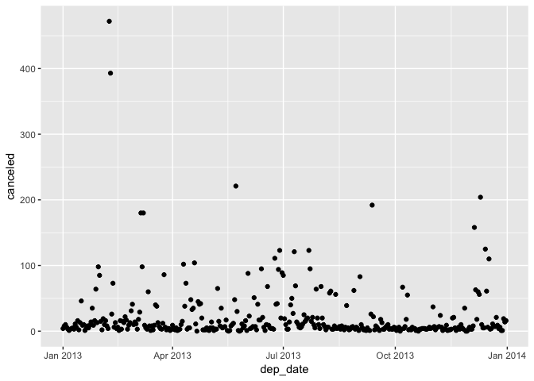
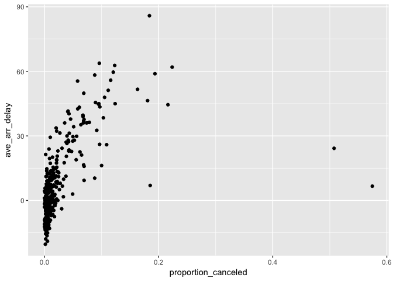
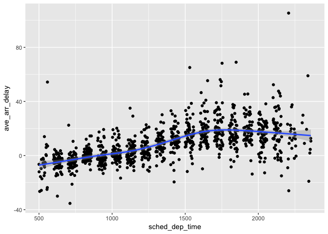

# data.transformation.2
Veronica  
5/15/2017  


#### Grouped summaries with summarize()

**1. Brainstorm at least 5 different ways to assess the typical delay characteristics of a group of flights. Consider the following scenarios:**  
*A flight is 15 minutes early 50% of the time, and 15 minutes late 50% of the time.   
*A flight is always 10 minutes late.   
*A flight is 30 minutes early 50% of the time, and 30 minutes late 50% of the time.  
*99% of the time a flight is on time. 1% of the time it’s 2 hours late.  

**2. Come up with another approach that will give you the same output as not_cancelled %>% count(dest) and not_cancelled %>% count(tailnum, wt = distance) (without using count()).**


```r
not_cancelled <- flights %>% 
  filter(!is.na(dep_delay), !is.na(arr_delay))
not_cancelled %>% count(dest)
```

```
## # A tibble: 104 × 2
##     dest     n
##    <chr> <int>
## 1    ABQ   254
## 2    ACK   264
## 3    ALB   418
## 4    ANC     8
## 5    ATL 16837
## 6    AUS  2411
## 7    AVL   261
## 8    BDL   412
## 9    BGR   358
## 10   BHM   269
## # ... with 94 more rows
```

```r
not_cancelled %>% count(tailnum, wt = distance)
```

```
## # A tibble: 4,037 × 2
##    tailnum      n
##      <chr>  <dbl>
## 1   D942DN   3418
## 2   N0EGMQ 239143
## 3   N10156 109664
## 4   N102UW  25722
## 5   N103US  24619
## 6   N104UW  24616
## 7   N10575 139903
## 8   N105UW  23618
## 9   N107US  21677
## 10  N108UW  32070
## # ... with 4,027 more rows
```

```r
not_cancelled %>%
  group_by(dest) %>%
  summarise(flights = n()) 
```

```
## # A tibble: 104 × 2
##     dest flights
##    <chr>   <int>
## 1    ABQ     254
## 2    ACK     264
## 3    ALB     418
## 4    ANC       8
## 5    ATL   16837
## 6    AUS    2411
## 7    AVL     261
## 8    BDL     412
## 9    BGR     358
## 10   BHM     269
## # ... with 94 more rows
```

```r
not_cancelled %>%
  group_by(tailnum) %>%
  summarise(flights = sum(distance))
```

```
## # A tibble: 4,037 × 2
##    tailnum flights
##      <chr>   <dbl>
## 1   D942DN    3418
## 2   N0EGMQ  239143
## 3   N10156  109664
## 4   N102UW   25722
## 5   N103US   24619
## 6   N104UW   24616
## 7   N10575  139903
## 8   N105UW   23618
## 9   N107US   21677
## 10  N108UW   32070
## # ... with 4,027 more rows
```

**3. Our definition of cancelled flights (is.na(dep_delay) | is.na(arr_delay) ) is slightly suboptimal. Why? Which is the most important column?**

Flghts that departed by did not arrive indicated tha tthe flights did safely reach their destination. Coding it this way allows more room for typing errors. dep_delay is more important here, so is.na(dep_delay) can be used instead.

**4. Look at the number of cancelled flights per day. Is there a pattern? Is the proportion of cancelled flights related to the average delay?**   

```r
flights %>% 
  mutate(dep_date = lubridate::make_datetime(year, month, day)) %>%
  group_by(dep_date) %>%
  summarize(canceled = sum(is.na(dep_time))) %>%
  ggplot(aes(x = dep_date, y = canceled)) + 
  geom_point() 
```

<!-- -->

```r
flights %>%
  mutate(dep_date = lubridate::make_datetime(year, month, day)) %>%
  group_by(dep_date) %>%
  summarise(proportion_canceled = sum(is.na(dep_time)/n()),
            ave_arr_delay = mean(arr_delay, na.rm = TRUE)) %>%
  ggplot(aes(x = proportion_canceled, y = ave_arr_delay)) + 
  geom_point()
```

<!-- -->
The proportion of delayed flights and average arival delay are positively correlated.

**5. Which carrier has the worst delays? Challenge: can you disentangle the effects of bad airports vs. bad carriers? Why/why not? (Hint: think about flights %>% group_by(carrier, dest) %>% summarise(n()))**  

```r
flights %>% 
  group_by(carrier) %>%
  summarize(ave_arrival_delay = mean(arr_delay, na.rm = TRUE), n = n()) %>%
  arrange(desc(ave_arrival_delay))
```

```
## # A tibble: 16 × 3
##    carrier ave_arrival_delay     n
##      <chr>             <dbl> <int>
## 1       F9        21.9207048   685
## 2       FL        20.1159055  3260
## 3       EV        15.7964311 54173
## 4       YV        15.5569853   601
## 5       OO        11.9310345    32
## 6       MQ        10.7747334 26397
## 7       WN         9.6491199 12275
## 8       B6         9.4579733 54635
## 9       9E         7.3796692 18460
## 10      UA         3.5580111 58665
## 11      US         2.1295951 20536
## 12      VX         1.7644644  5162
## 13      DL         1.6443409 48110
## 14      AA         0.3642909 32729
## 15      HA        -6.9152047   342
## 16      AS        -9.9308886   714
```
Frontier Airlines has the longest average arrival delay but a relatively small number of flights compared to most of the carriers.

**What does the sort argument to count() do. When might you use it?**  
The sort argument in count() will arrange the data in descending order based on count(). 

#### 5.7 Group mutates (and filters)

**1. Refer back to the lists of useful mutate and filtering functions. Describe how each operation changes when you combine it with grouping.**  

**2. Which plane (tailnum) has the worst on-time record?**  

```r
not_cancelled %>%
  group_by(tailnum) %>%
  summarize(proportion_delay = sum(arr_delay > 0)/n()) %>%
  arrange(desc(proportion_delay))
```

```
## # A tibble: 4,037 × 2
##    tailnum proportion_delay
##      <chr>            <dbl>
## 1   N121DE                1
## 2   N136DL                1
## 3   N143DA                1
## 4   N17627                1
## 5   N240AT                1
## 6   N26906                1
## 7   N295AT                1
## 8   N302AS                1
## 9   N303AS                1
## 10  N32626                1
## # ... with 4,027 more rows
```
There are many planes that are always delayed.

**3. What time of day should you fly if you want to avoid delays as much as possible?**  

```r
not_cancelled %>%
  group_by(sched_dep_time) %>%
  summarize(ave_arr_delay = mean(arr_delay)) %>%
  ggplot(aes(x = sched_dep_time, y = ave_arr_delay)) + 
  geom_point() + 
  geom_smooth()
```

```
## `geom_smooth()` using method = 'gam'
```

<!-- -->

**4. For each destination, compute the total minutes of delay. For each, flight, compute the proportion of the total delay for its destination.**  

```r
#not_cancelled %>%
#  filter(dest) %>%
#  group_by(flight) %>%
#  summarize(flight_delay = sum(arr_delay)) 
not_cancelled %>%
  group_by(tailnum, dest) %>%
  summarize(flight_delay = sum(arr_delay))
```

```
## Source: local data frame [44,173 x 3]
## Groups: tailnum [?]
## 
##    tailnum  dest flight_delay
##      <chr> <chr>        <dbl>
## 1   D942DN   ATL           80
## 2   D942DN   MCO           46
## 3   N0EGMQ   ATL          556
## 4   N0EGMQ   BNA          253
## 5   N0EGMQ   CLE          132
## 6   N0EGMQ   CLT          617
## 7   N0EGMQ   CMH          615
## 8   N0EGMQ   DCA          114
## 9   N0EGMQ   DTW         -199
## 10  N0EGMQ   MSP          747
## # ... with 44,163 more rows
```
very lost on this one...

**5. Delays are typically temporally correlated: even once the problem that caused the initial delay has been resolved, later flights are delayed to allow earlier flights to leave. Using lag() explore how the delay of a flight is related to the delay of the immediately preceding flight.**  

```r
flights %>%
  group_by(year, month, day) %>%
  filter(dest=="LGA", rank(sched_dep_time))
```

```
## Source: local data frame [1 x 19]
## Groups: year, month, day [1]
## 
##    year month   day dep_time sched_dep_time dep_delay arr_time
##   <int> <int> <int>    <int>          <int>     <dbl>    <int>
## 1  2013     7    27       NA            106        NA       NA
## # ... with 12 more variables: sched_arr_time <int>, arr_delay <dbl>,
## #   carrier <chr>, flight <int>, tailnum <chr>, origin <chr>, dest <chr>,
## #   air_time <dbl>, distance <dbl>, hour <dbl>, minute <dbl>,
## #   time_hour <dttm>
```
this is making me cry...

**6. Look at each destination. Can you find flights that are suspiciously fast? (i.e. flights that represent a potential data entry error). Compute the air time a flight relative to the shortest flight to that destination. Which flights were most delayed in the air?**  

```r
#flights %>%
#  group_by(dest) %>%
#  summarize(arr_time = )
```
lost here too...

**7. Find all destinations that are flown by at least two carriers. Use that information to rank the carriers.**

```r
flights %>%
  group_by(dest) %>%
  summarize(num_carriers = n_distinct(carrier)) %>%
  filter(num_carriers >= 2)
```

```
## # A tibble: 76 × 2
##     dest num_carriers
##    <chr>        <int>
## 1    ATL            7
## 2    AUS            6
## 3    AVL            2
## 4    BDL            2
## 5    BGR            2
## 6    BNA            5
## 7    BOS            7
## 8    BQN            2
## 9    BTV            3
## 10   BUF            4
## # ... with 66 more rows
```
Not sure how to rank.

**8. For each plane, count the number of flights before the first delay of greater than 1 hour.**


