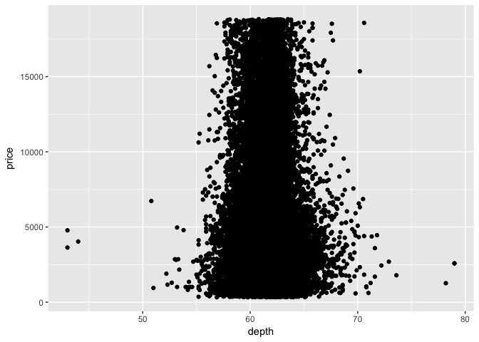

# EDA.1
Veronica  
5/22/2017  


## 7. Exploratory Data Analysis

#### 7.3 Variation

**1. Explore the distribution of each of the x, y, and z variables in diamonds. What do you learn? Think about a diamond and how you might decide which dimension is the length, width, and depth.**    

```r
ggplot(data = diamonds) + 
  geom_histogram(mapping = aes(x = x), binwidth = .5)
```

<!-- -->

```r
ggplot(data = diamonds) + 
  geom_histogram(mapping = aes(x = x), binwidth = .5) + 
  coord_cartesian(ylim = c(0,100))
```

<!-- -->

```r
#between 3 and 11

ggplot(data = diamonds) + 
  geom_histogram(mapping = aes(x = y), binwidth = .5)
```

<!-- -->

```r
ggplot(data = diamonds) + 
  geom_histogram(mapping = aes(x = y), binwidth = .5) +
  coord_cartesian(xlim = c(3,12), ylim = c(0,50))
```

<!-- -->

```r
#between 3 and 11

ggplot(data = diamonds) + 
  geom_histogram(mapping = aes(x = z), binwidth = .5)
```

<!-- -->

```r
ggplot(data = diamonds) + 
  geom_histogram(mapping = aes(x = x), binwidth = .5) +
  coord_cartesian(ylim = c(0, 50))
```

<!-- -->

```r
#between 3 and 11
```
Google and learn something about diamonds?

**2. Explore the distribution of price. Do you discover anything unusual or surprising? (Hint: Carefully think about the binwidth and make sure you try a wide range of values.)**  

```r
ggplot(data = diamonds) +
  geom_histogram(mapping = aes(x = price), binwidth = .5) +
  coord_cartesian(xlim = c(1300,1600))
```

<!-- -->
There are no diamonds in the $1450 to $1550 price range. 

**3. How many diamonds are 0.99 carat? How many are 1 carat? What do you think is the cause of the difference?**  

```r
diamonds %>% 
  filter(carat == .99 | carat == 1.00) %>% 
  ggplot() +
  geom_histogram(mapping = aes(x = carat), binwidth = 0.01)
```

<!-- -->
There are over 1500 1 carat diamonds and less than 100 .99 carat diamonds. This may be because diamonds of less than 1 carat are worth less so people round the carat value up or discard the diamonds if they are low weight.

**4. Compare and contrast coord_cartesian() vs xlim() or ylim() when zooming in on a histogram. What happens if you leave binwidth unset? What happens if you try and zoom so only half a bar shows?**   
xlim() and ylim() allow values outside of the prescribed range to be cahnged to NA. Coord_cartesian() allows the data to be zoomed in and out on, without dropping values.  

```r
ggplot(data = diamonds) + 
  geom_histogram(mapping = aes(x = table)) + 
  coord_cartesian(xlim = c(45,75))
```

```
## `stat_bin()` using `bins = 30`. Pick better value with `binwidth`.
```

<!-- -->

```r
ggplot(data = diamonds) + 
  geom_histogram(mapping = aes(x = table)) + 
  xlim(45, 75)
```

```
## `stat_bin()` using `bins = 30`. Pick better value with `binwidth`.
```

```
## Warning: Removed 5 rows containing non-finite values (stat_bin).
```

<!-- -->

```r
ggplot(data = diamonds) + 
  geom_histogram(mapping = aes(x = table)) + 
  xlim(45, 75) + 
  ylim(0, 5000)
```

```
## `stat_bin()` using `bins = 30`. Pick better value with `binwidth`.
```

```
## Warning: Removed 5 rows containing non-finite values (stat_bin).
```

```
## Warning: Removed 5 rows containing missing values (geom_bar).
```

<!-- -->

#### Missing values 

**1. What happens to missing values in a histogram? What happens to missing values in a bar chart? Why is there a difference?**  

```r
diamonds2 <- diamonds %>% 
  mutate(y = ifelse(y < 3 | y > 20, NA, y))
ggplot(diamonds2) +
  geom_histogram(mapping = aes(x=y))
```

```
## `stat_bin()` using `bins = 30`. Pick better value with `binwidth`.
```

```
## Warning: Removed 9 rows containing non-finite values (stat_bin).
```

<!-- -->

```r
ggplot(diamonds2) +
  geom_bar(mapping = aes(x=y))
```

```
## Warning: Removed 9 rows containing non-finite values (stat_count).
```

<!-- -->
There does not appear to de a difference between the treatment of NAs by geom_bar() and geom_ histogram(). Both remove NAs and pass a warning when graphing.

**2. What does na.rm = TRUE do in mean() and sum()?**  

```r
mean(diamonds2$y)
```

```
## [1] NA
```

```r
mean(diamonds2$y, na.rm = TRUE)
```

```
## [1] 5.733801
```

```r
sum(diamonds2$y)
```

```
## [1] NA
```

```r
sum(diamonds2$y, na.rm = TRUE)
```

```
## [1] 309229.6
```
na.rm = TRUE removes NA values. If NA values are not removed these functions will return NA without making a calculaton. 

#### 7.5 Covariance  
##### 7.5.1 Categorical and Continuous  
**1.Use what you’ve learned to improve the visualisation of the departure times of cancelled vs. non-cancelled flights.**  

```r
flights2 <- flights %>% 
  mutate(
    cancelled = is.na(dep_time),
    sched_hour = sched_dep_time %/% 100,
    sched_min = sched_dep_time %% 100,
    sched_dep_time = sched_hour + sched_min / 60)
    
flights2 %>% 
  ggplot(mapping = aes(sched_dep_time)) + 
  geom_freqpoly(mapping = aes(colour = cancelled), binwidth = 1/4)
```

<!-- -->

```r
flights2 %>%
  ggplot(mapping = aes(x = sched_dep_time, y = ..density..)) +
  geom_freqpoly(mapping = aes(color = cancelled))
```

```
## `stat_bin()` using `bins = 30`. Pick better value with `binwidth`.
```

<!-- -->

```r
flights2 %>% 
  ggplot(mapping = aes(x = cancelled, y = sched_dep_time)) +
  geom_boxplot()
```

<!-- -->

**2. What variable in the diamonds dataset is most important for predicting the price of a diamond? How is that variable correlated with cut? Why does the combination of those two relationships lead to lower quality diamonds being more expensive?**  

```r
diamonds %>%
  ggplot(mapping = aes(x = price, y = ..density.., color = cut)) +
  geom_freqpoly()
```

```
## `stat_bin()` using `bins = 30`. Pick better value with `binwidth`.
```

<!-- -->

```r
diamonds %>%
  ggplot(mapping = aes(x = price, y = ..density.., color = color)) +
  geom_freqpoly()
```

```
## `stat_bin()` using `bins = 30`. Pick better value with `binwidth`.
```

<!-- -->

```r
diamonds %>%
  ggplot(mapping = aes(x = price, y = ..density.., color = clarity)) +
  geom_freqpoly()
```

```
## `stat_bin()` using `bins = 30`. Pick better value with `binwidth`.
```

<!-- -->

```r
diamonds %>%
  ggplot(mapping = aes(x = price, y = ..density.., color = cut)) +
  geom_freqpoly()
```

```
## `stat_bin()` using `bins = 30`. Pick better value with `binwidth`.
```

<!-- -->

```r
diamonds %>%
  ggplot(mapping = aes(x = carat, y = price)) + 
  geom_point()
```

<!-- -->

```r
diamonds %>%
  ggplot(mapping = aes(x = depth, y = price)) + 
  geom_point()
```

<!-- -->

```r
diamonds %>%
  ggplot(mapping = aes(x = table, y = price), stat = "count") + 
  geom_point()
```

<!-- -->

Carat seems to be the most strongly coordinated characteristic with price.


```r
diamonds %>%
  ggplot(mapping = aes(x = cut, y = carat)) + 
  geom_boxplot()
```

<!-- -->
Cut and carat are not coorelated but carat is positively coorelated with price. Diamonds with poor cuts can be expensive if they are high carat, and ideal cut diamonds can be inexpensive due to low carat size.

**3. Install the ggstance package, and create a horizontal boxplot. How does this compare to using coord_flip()?**  

```r
library(ggstance)
```

```
## Warning: package 'ggstance' was built under R version 3.3.2
```

```
## 
## Attaching package: 'ggstance'
```

```
## The following objects are masked from 'package:ggplot2':
## 
##     geom_errorbarh, GeomErrorbarh
```

```r
diamonds %>%
  ggplot(mapping = aes(x = color, y = price)) + 
  geom_boxplot() 
```

<!-- -->

```r
diamonds %>%
  ggplot(mapping = aes(x = price,y = color)) + 
  geom_boxploth() 
```

<!-- -->

```r
diamonds %>%
  ggplot(mapping = aes(x = color, y = price)) + 
  geom_boxplot() +
  coord_flip()
```

<!-- -->

Using coord_flip() takes the arguments passed for a vertical graph and inverts everything. ggstance allows you  to supply arguments for the horizontal plot in the way that they will be presented in the graph   
in ggstance, x = x variable, y = y variable in horizontal plot  
coord_flip(), x = y variable, y = x variable in horizontal plot

**4. One problem with boxplots is that they were developed in an era of much smaller datasets and tend to display a prohibitively large number of “outlying values”. One approach to remedy this problem is the letter value plot. Install the lvplot package, and try using geom_lv() to display the distribution of price vs cut. What do you learn? How do you interpret the plots?**  

```r
#library(lvplot)
#diamonds %>%
#  ggplot(mapping = aes(x = cut, y = price)) + 
#  geom_lv()
```

**5. Compare and contrast geom_violin() with a facetted geom_histogram(), or a coloured geom_freqpoly(). What are the pros and cons of each method?**  

```r
diamonds %>%
  ggplot(mapping = aes(x = cut, y = price)) + 
  geom_violin()
```

<!-- -->

```r
diamonds %>%
  ggplot(mapping = aes(x = price, y = ..density.., color = cut)) + 
  geom_freqpoly()
```

```
## `stat_bin()` using `bins = 30`. Pick better value with `binwidth`.
```

<!-- -->

```r
diamonds %>%
  ggplot(mapping = aes(x=price, y = ..density..)) +
  geom_histogram() +
  facet_grid(. ~ cut)
```

```
## `stat_bin()` using `bins = 30`. Pick better value with `binwidth`.
```

<!-- -->
geom_violin() is a way to clearly compare distributions of values across differnet classes. If paired with geom_boxplot() it can also provide some statistical information about the distributions. The other strategies are harder to compare but perhaps easier to see the distribution of each cut individually. 

**6. If you have a small dataset, it’s sometimes useful to use geom_jitter() to see the relationship between a continuous and categorical variable. The ggbeeswarm package provides a number of methods similar to geom_jitter(). List them and briefly describe what each one does.**  
grouponX, determines which axis to jitter on
dodge.width, determines spacing of jitter

##### 7.5.2 Two categorical

**1. How could you rescale the count dataset above to more clearly show the distribution of cut within colour, or colour within cut?**  

```r
diamonds %>% 
  count(color, cut) %>%  
  ggplot(mapping = aes(x = color, y = cut)) +
  geom_tile(mapping = aes(fill = n)) + 
  scale_fill_gradient(low="blue", high="red")
```

<!-- -->
Not sure how to do this one, but I did change the color...

**2. Use geom_tile() together with dplyr to explore how average flight delays vary by destination and month of year. What makes the plot difficult to read? How could you improve it?**  

```r
flights %>%
  group_by(month, dest) %>%
  summarise(dep_delay = mean(dep_delay, na.rm = TRUE)) %>%
  ggplot(mapping = aes(x = factor(month), y = dest)) +
  geom_tile(mapping = aes(fill = dep_delay))
```

<!-- -->
There are too many destinations to read. This could be aleviated by filtering for flights that do not run all year or grouping the destinations together, perhaps by state or region.

**3. Why is it slightly better to use aes(x = color, y = cut) rather than aes(x = cut, y = color) in the example above?**  

```r
diamonds %>% 
  count(color, cut) %>%  
  ggplot(mapping = aes(x = color, y = cut)) +
  geom_tile(mapping = aes(fill = n)) + 
  scale_fill_gradient(low="blue", high="red")
```

<!-- -->

```r
diamonds %>% 
  count(color, cut) %>%  
  ggplot(mapping = aes(x = cut, y = color)) +
  geom_tile(mapping = aes(fill = n)) + 
  scale_fill_gradient(low="blue", high="red")
```

<!-- -->

The former is better aesthetically because there are more categories in color than cut. More columns is prettier than more rows. 

##### 7.5.3 Two continuous variables

**1. Instead of summarising the conditional distribution with a boxplot, you could use a frequency polygon. What do you need to consider when using cut_width() vs cut_number()? How does that impact a visualisation of the 2d distribution of carat and price?**   
When using cut_width() there is no indication of the number of observations in each bin. In cut_number() all of the box plots have the same number of observations, and box width varies by the spread of the data across the x variable. cut_width() is misleading in that is appears that diamonds are evenly distributed along carat size, while cut_number is more imformative about the distaribution of observations within carat size.

**2. Visualise the distribution of carat, partitioned by price.**  

```r
ggplot(data = diamonds, mapping = aes(x = price, y = carat)) +
  geom_boxplot(mapping = aes(group = cut_number(price, 20)))
```

<!-- -->


**3. How does the price distribution of very large diamonds compare to small diamonds. Is it as you expect, or does it surprise you?**


