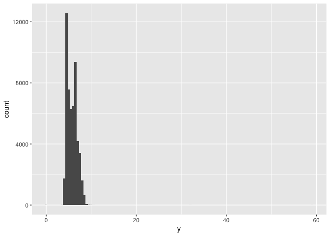

# EDA.1
Veronica  
5/22/2017  


## 7. Exploratory Data Analysis

#### 7.3 Variation

**1. Explore the distribution of each of the x, y, and z variables in diamonds. What do you learn? Think about a diamond and how you might decide which dimension is the length, width, and depth.**    

```r
ggplot(data = diamonds) + 
  geom_histogram(mapping = aes(x = x), binwidth = .5)
```

<!-- -->

```r
ggplot(data = diamonds) + 
  geom_histogram(mapping = aes(x = x), binwidth = .5) + 
  coord_cartesian(ylim = c(0,100))
```

<!-- -->

```r
#between 3 and 11

ggplot(data = diamonds) + 
  geom_histogram(mapping = aes(x = y), binwidth = .5)
```

<!-- -->

```r
ggplot(data = diamonds) + 
  geom_histogram(mapping = aes(x = y), binwidth = .5) +
  coord_cartesian(xlim = c(3,12), ylim = c(0,50))
```

<!-- -->

```r
#between 3 and 11

ggplot(data = diamonds) + 
  geom_histogram(mapping = aes(x = z), binwidth = .5)
```

<!-- -->

```r
ggplot(data = diamonds) + 
  geom_histogram(mapping = aes(x = x), binwidth = .5) +
  coord_cartesian(ylim = c(0, 50))
```

<!-- -->

```r
#between 3 and 11
```
Google and learn something about diamonds.

**2. Explore the distribution of price. Do you discover anything unusual or surprising? (Hint: Carefully think about the binwidth and make sure you try a wide range of values.)**  

```r
ggplot(data = diamonds) +
  geom_histogram(mapping = aes(x = price), binwidth = .5) +
  coord_cartesian(xlim = c(1300,1600))
```

<!-- -->
There are no diamonds in the $1450 to $1550 price range. 

**3. How many diamonds are 0.99 carat? How many are 1 carat? What do you think is the cause of the difference?**  

```r
diamonds %>% 
  filter(carat == .99 | carat == 1.00) %>% 
  ggplot() +
  geom_histogram(mapping = aes(x = carat), binwidth = 0.01)
```

<!-- -->
There are over 1500 1 carat diamonds and less than 100 .99 carat diamonds. This may be because diamonds of less than 1 carat are worth less so people round the carat value up or discard the diamonds if they are low weight.

**4. Compare and contrast coord_cartesian() vs xlim() or ylim() when zooming in on a histogram. What happens if you leave binwidth unset? What happens if you try and zoom so only half a bar shows?**  
xlim() and ylim() allow values outside of the prescribed range to be cahnged to NA. Coord_cartesian() allows the data to be zoomed in and out on, without dropping values. 

```r
ggplot(data = diamonds) + 
  geom_histogram(mapping = aes(x = table)) + 
  coord_cartesian(xlim = c(45,75))
```

```
## `stat_bin()` using `bins = 30`. Pick better value with `binwidth`.
```

<!-- -->

```r
ggplot(data = diamonds) + 
  geom_histogram(mapping = aes(x = table)) + 
  xlim(45, 75)
```

```
## `stat_bin()` using `bins = 30`. Pick better value with `binwidth`.
```

```
## Warning: Removed 5 rows containing non-finite values (stat_bin).
```

<!-- -->

```r
ggplot(data = diamonds) + 
  geom_histogram(mapping = aes(x = table)) + 
  xlim(45, 75) + 
  ylim(0, 5000)
```

```
## `stat_bin()` using `bins = 30`. Pick better value with `binwidth`.
```

```
## Warning: Removed 5 rows containing non-finite values (stat_bin).
```

```
## Warning: Removed 5 rows containing missing values (geom_bar).
```

<!-- -->

#### Missing values 

**1. 


